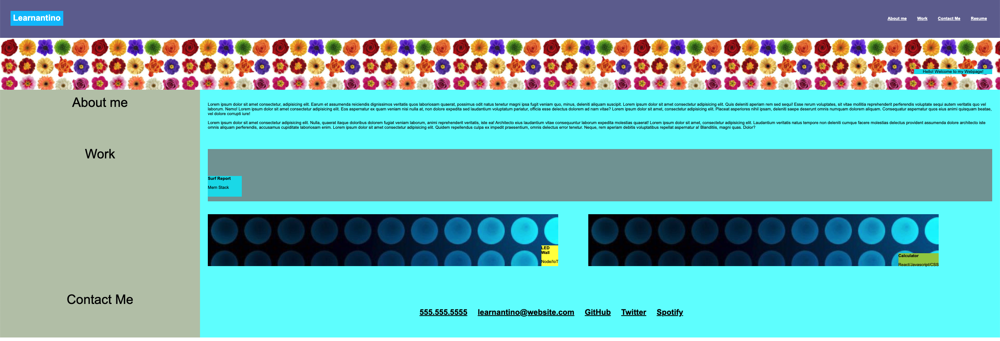

# homework-2

##
This is my homework #2. 

**I** had to use HTML & CSS to deploy a personal portfolio page. 

In my homework, specifically in CSS, I used some of the materials that we went over in class; such as, flexbox, media queries, and CSS variables. 

Some of elements & contents in my portfolio are placeholders, since it was stated in the direction that we will be making edits & modification as we go along into semester. 

Attached is my screenshot of my personal portfolio page.

Attached is also a personal link to my homework assignment #2.

## https://jung0808.github.io/homework-2/

## https://github.com/jung0808/homework-2
